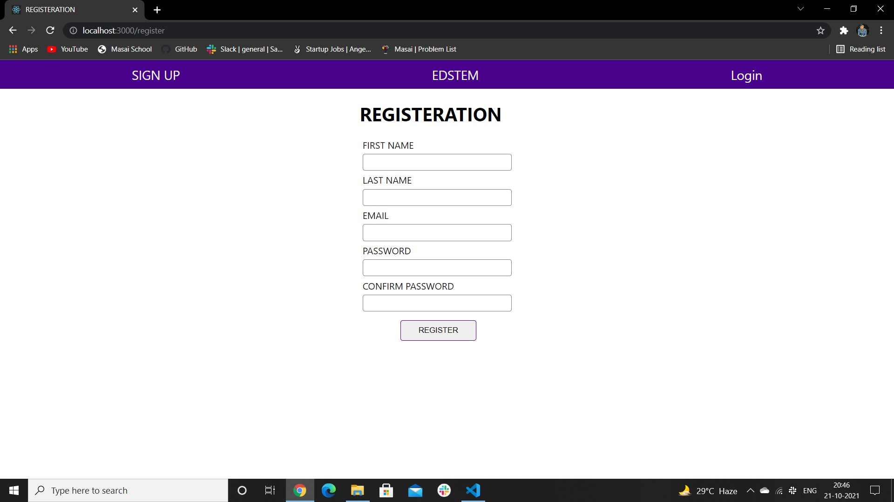
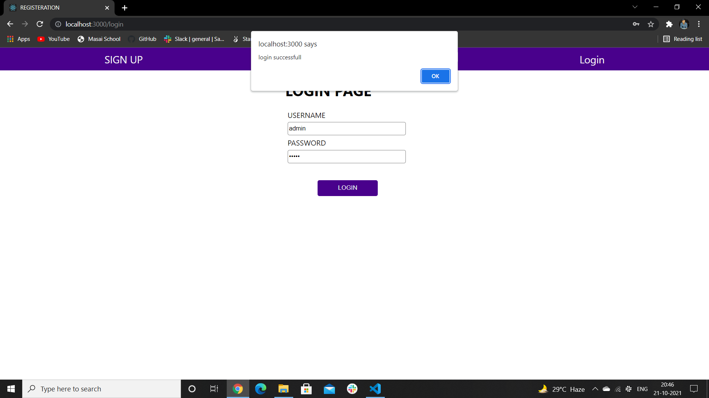
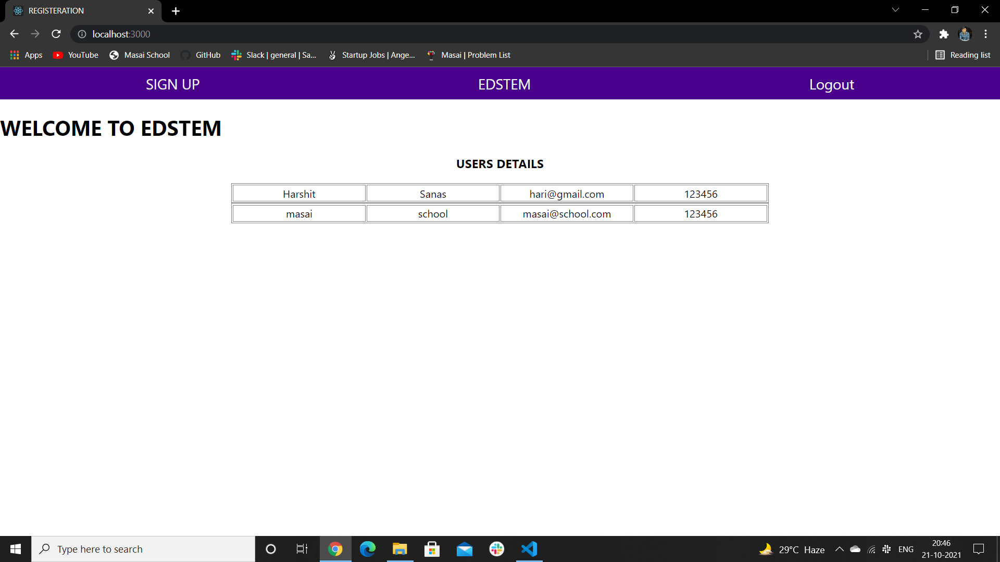

# React Application using MongoDB, ExpressJS, ReactJS & NodeJS

<h3>Registration Page</h3>

<h3>Login Page</h3>

<h3>Home Page</h3>

<h1>TECH STACK</h1>

REACT JS

MongoDB

Express JS

Node JS

# To run Backend cd backend ==>> npm run servers

# To run frondend npm start

# github link 
# <a href="https://github.com/Harshsanas/edstem_mernstack.git"> https://github.com/Harshsanas/edstem_mernstack.git
  
# Git Clone https://github.com/Harshsanas/edstem_mernstack.git
  
# cd backend >> npm i >> npm run server
  
# for start application >> ..cd npm i >> npm start http://localhost:3000/
 
